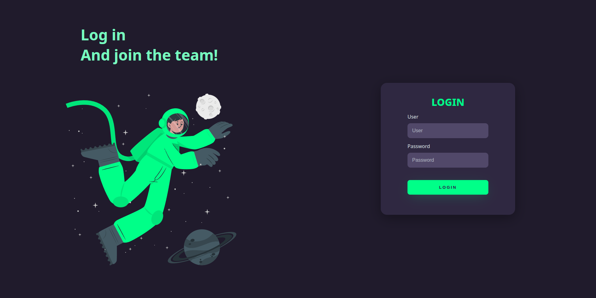

# Dark-LoginPage

> A simple responsive login page.

>  Access the project [here](https://gabriel-preti-ferraz.github.io/Dark-LoginPage/frontend).

## 🧪 Technologies

Here are the technologies used in this project:

* HTML and CSS.

## 🚀 Installing Dark-LoginPage

To install Dark-LoginPage, follow these steps:

* Click on `Code`;
* Click on `Download ZIP`;
* Extract the project.

## ☕ Using Dark-LoginPage

To use Dark-LoginPage, follow these steps:

* Open the `index.html` in the `frontend` paste.

## 📫 Contributing to Dark-LoginPage
To contribute to Dark-LoginPage, follow these steps:

1. Fortk this repository;
2. Create a branch: `git checkout -b <branch_name>`;
3. Make your changes and commit them: `git commit -m '<commit_message>'`;
4. Push to the original branch: `git push origin Dark-LoginPage / <local>`;
5. Create a pull request.

Alternatively, refer to GitHub’s documentation on [how to create a pull request](https://help.github.com/en/github/collaborating-with-issues-and-pull-requests/creating-a-pull-request).

## 📝 License

This project is under license. See the archive [LICENSE](LICENSE.md) for more details.

[⬆ Back to top](#Dark-LoginPage) 
